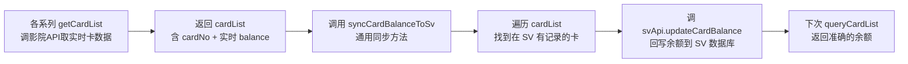

# 会员卡余额同步实现

## 修改文件

| 文件                                                          | 操作     | 说明                                                                   |
| ------------------------------------------------------------- | -------- | ---------------------------------------------------------------------- |
| `src/common/autoTicket/buyTicket/common/cardBalanceSync.js`   | **新增** | 通用余额同步模块                                                       |
| `src/common/autoTicket/buyTicket/wanda/cardQuanManage.js`     | **修改** | 加入余额同步调用                                                       |
| `src/common/autoTicket/buyTicket/chenxing/cardQuanManage.js`  | **修改** | 加入余额同步调用                                                       |
| `src/common/autoTicket/buyTicket/fenghuang/cardQuanManage.js` | **修改** | 加入余额同步调用                                                       |
| `src/common/autoTicket/buyTicket/jinyi/cardQuanManage.js`     | **修改** | 加入余额同步调用                                                       |
| `src/common/autoTicket/buyTicket/sfc/cardQuanManage.js`       | **修改** | 加入余额同步调用                                                       |
| `src/common/autoTicket/buyTicket/lma/cardQuanManage.js`       | **修改** | 加入余额同步调用                                                       |
| `src/common/autoTicket/buyTicket/ume/buyTicket.js`            | **修改** | 加入余额同步调用（卡列表来自 `orderManage.getOptimalCardQuanCompose`） |
| `src/common/autoTicket/buyTicket/h5ume/buyTicket.js`          | **修改** | 加入余额同步调用（卡列表来自 `orderManage.getOptimalCardQuanCompose`） |

## 方案

各系列进行用卡用券流程时，会经过两个卡列表：

| 列表                 | 来源                                                   | 余额准确性                                |
| -------------------- | ------------------------------------------------------ | ----------------------------------------- |
| **SV 会员卡列表**    | `svApi.queryCardList()` 读取 SV 数据库 `cardRecord` 表 | ❌ 可能滞后（仅出票后更新，且手动才同步） |
| **各平台实时卡列表** | 各系列 `cardQuanManage.getCardList()` 调对应影院 API   | ✅ 实时余额                               |

两个列表通过 `card_num`（SV）↔ `cardNo`（平台 API）关联。

## 现状

- 各系列 `getCardList()` 拿到实时余额后仅用于当前交易，**未回写**到 SV 数据库
- `svApi.updateCardBalance()` 接口已存在，但目前仅在 **LMA 出票后**调用来扣减余额，未做余额同步
- `cardList.vue` 页面的「同步卡信息」功能是手动触发的全量同步

## 目标

在自动出票流程中取到实时余额后，同步写回 SV 数据库 `cardRecord` 表，确保：

1. 系统内展示的余额始终接近真实值
2. 后续 `getUsableCardList()` 过滤时使用准确的余额判断

## 方案

### 整体思路

创建通用方法 `syncCardBalanceToSv()`，各系列在 `getCardList()` 返回后调用它，将实时余额写回 SV。



### 新增文件：`src/common/autoTicket/buyTicket/common/cardBalanceSync.js`

```javascript
/**
 * 会员卡余额同步模块
 *
 * 职责：将各影院平台返回的实时卡余额同步回 SV 数据库 cardRecord 表
 *
 * 使用方式：
 *   在各系列 cardQuanManage.getCardList() 返回后调用
 *
 *   const cardList = await this.getCardList(params);
 *   syncCardBalanceToSv({
 *     appFlag: this.appFlag,
 *     cardList,
 *     logger: this.logger
 *   }).catch(e => logger.warn("余额同步失败(不影响主流程)", e));
 */

import svApi from "@/api/sv-api";
import { formatErrInfo } from "@/utils/utils";

/**
 * 将各平台实时卡余额同步到 SV 数据库
 *
 * @param {Object} params
 * @param {string} params.appFlag - 影院标识（app_name）
 * @param {Array<Object>} params.cardList - getCardList 返回的实时卡列表
 * @param {Function} [params.logger] - 可选 logger
 * @param {Function} [params.getCardId] - 可选：从平台卡对象中提取 SV card_id 的方法（默认用 item.cardNo）
 * @param {Function} [params.getBalance] - 可选：从平台卡对象中提取余额的方法（默认用 item.balance）
 * @param {number} [params.balanceDivisor] - 可选：余额除数（如万达以分为单位时传 100）
 */
export async function syncCardBalanceToSv({
  appFlag,
  cardList,
  logger,
  getCardId = item => item.cardNo,
  getBalance = item => item.balance,
  balanceDivisor = 1
}) {
  if (!appFlag || !cardList?.length) return;

  let syncCount = 0;
  for (const card of cardList) {
    const cardId = getCardId(card);
    const rawBalance = getBalance(card);
    if (cardId == null || rawBalance == null) continue;

    const balance = (rawBalance / balanceDivisor).toFixed(2);

    try {
      await svApi.updateCardBalance({
        card_id: cardId,
        app_name: appFlag,
        balance: String(balance)
      });
      syncCount++;
    } catch (error) {
      logger?.warn?.("同步单张卡余额失败", {
        cardId,
        error: formatErrInfo(error)
      });
    }
  }

  if (syncCount > 0) {
    logger?.infoSave?.("会员卡余额同步完成", { appFlag, syncCount });
  }
}
```

### 各系列接入改动

在每个系列的 `cardQuanManage.js` 中，`getCardList()` 返回前添加一行调用。

| 系列                 | getCardId          | getBalance                  | balanceDivisor  | 备注                                                    |
| -------------------- | ------------------ | --------------------------- | --------------- | ------------------------------------------------------- |
| **万达 (wanda)**     | `item.cardNo`      | `item.balance`              | 100（分为单位） | cardQuanManage.getCardList                              |
| **辰星 (chenxing)**  | `item.cardNo`      | `item.amount`               | 1               | cardQuanManage.getCardList                              |
| **凤凰 (fenghuang)** | `item.cardNo`      | `item.balance`              | 100（分为单位） | cardQuanManage.getCardList                              |
| **金逸 (jinyi)**     | `item.cardNo`      | `item.card_balance`         | 1               | cardQuanManage.getCardList                              |
| **SFC**              | `item.card_num`    | `item.balance`              | 1               | cardQuanManage.getCardList                              |
| **LMA**              | `item.card_number` | 解析 `money_str`（去 "￥"） | 1               | cardQuanManage.getCardList                              |
| **UME**              | `item.cardNo`      | `item.cardAmount`           | 1               | buyTicket.js（`orderManage.getOptimalCardQuanCompose`） |
| **H5UME**            | `item.cardNumber`  | `item.balance`              | 1               | buyTicket.js（`orderManage.getOptimalCardQuanCompose`） |

#### 万达（wanda）

```javascript
// src/common/autoTicket/buyTicket/wanda/cardQuanManage.js

import { syncCardBalanceToSv } from "@/common/autoTicket/buyTicket/common/cardBalanceSync";

// 在 getCardList 方法末尾，return 之前
async getCardList({ orderId, session_id }) {
  // ... 原有逻辑 ...
  const cardList = res?.data?.items || [];
  // ... 过滤逻辑 ...

  // [新增] 同步实时余额到 SV 数据库（非阻塞，不影响主流程）
  syncCardBalanceToSv({
    appFlag: this.appFlag,
    cardList,
    logger: this.logger,
    getCardId: item => item.cardNo,
    getBalance: item => item.balance,
    balanceDivisor: 100  // 万达余额以分为单位
  }).catch(e => this.logger.warn?.("同步万达卡余额异常(不影响主流程)", e));

  return cardList;
}
```

#### 辰星（chenxing）

```javascript
// src/common/autoTicket/buyTicket/chenxing/cardQuanManage.js

import { syncCardBalanceToSv } from "@/common/autoTicket/buyTicket/common/cardBalanceSync";

// 在 getCardList 方法末尾，return 之前
const cardList = res.data?.data?.cardVOs || [];
// ... 过滤 ...

syncCardBalanceToSv({
  appFlag: this.appFlag,
  cardList,
  logger: this.logger,
  getCardId: item => item.cardNo,
  getBalance: item => item.balance
}).catch(e => this.logger.warn?.("同步辰星卡余额异常", e));

return cardList;
```

#### 凤凰（fenghuang）

```javascript
// 同理，在 getCardList 返回前调用
syncCardBalanceToSv({
  appFlag: this.appFlag,
  cardList,
  logger: this.logger
}).catch(e => this.logger.warn?.("同步凤凰卡余额异常", e));
```

#### SFC / 金逸 / H5UME / LMA

同理，各系列按实际数据字段调整 `getCardId` / `getBalance` / `balanceDivisor`。

### 注意事项

| 要点         | 说明                                                                           |
| ------------ | ------------------------------------------------------------------------------ |
| **非阻塞**   | `syncCardBalanceToSv` 返回 Promise，各系列用 `.catch()` 包住，不影响主出票流程 |
| **幂等**     | 同一张卡多次同步同一余额不会产生副作用                                         |
| **频率**     | 每次出票流程都会触发一次同步，频率合理（数百张卡 × 每秒可完成数十次）          |
| **API 限流** | 若卡数量极大（如 100+），可考虑加防抖或批处理，但经评估当前无需                |

### 后续优化方向

1. 如果 SV 服务端支持批量更新余额，可将逐条 `updateCardBalance` 改为批量接口，减少请求次数
2. 可添加兜底逻辑：同步失败时不重试，等下次出票流程自动覆盖
