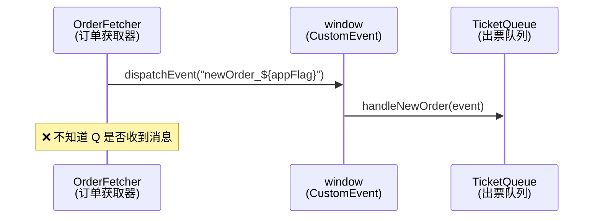
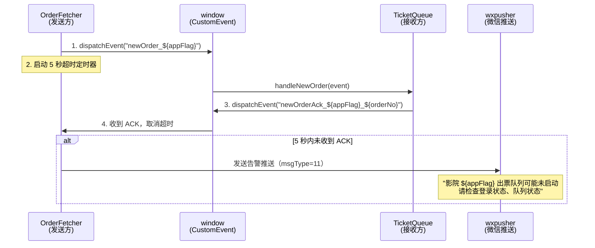

# 出票队列消息确认机制（ACK）设计

> 日期：2026-07-11
> 状态：✅ 已实现

---

## 一、背景与问题

### 1.1 现状

当前新订单消息的传递链路：



1. `BaseOrderFetcher.sendNewOrderMsg(order)` 通过 `window.dispatchEvent(new CustomEvent("newOrder_${appName}", ...))` 发送消息
2. `BaseTicketQueue` 通过 `window.addEventListener("newOrder_${appFlag}", ...)` 监听并调用 `handleNewOrder()` 处理
3. 这是一个**单向通知**——发送方无法确认接收方是否已启动、是否收到消息

### 1.2 线上故障场景

生产环境出现过：**发送了新订单消息，但订单长时间不出票**。排查时发现：

| 可能原因       | 具体表现                                                           |
| -------------- | ------------------------------------------------------------------ |
| 出票队列未启动 | `BaseTicketQueue.isStart === false`，`handleNewOrder` 直接 return  |
| 事件监听器丢失 | 页面刷新/模块重载后，`window` 上的事件监听器未重新绑定             |
| 影院未登录     | 队列虽然启动，但影院 `app_name` 不在登录列表中，实际未创建队列实例 |

**核心痛点**：发送方无法感知这些异常，导致消息发出后无人知晓"石沉大海"。

---

## 二、方案设计

### 2.1 核心思路：添加消息确认（ACK）+ 超时告警



### 2.2 修改文件清单

| 文件                                  | 操作 | 说明                                               |
| ------------------------------------- | ---- | -------------------------------------------------- |
| `src/common/core/BaseOrderFetcher.js` | 修改 | `sendNewOrderMsg()` 增加 ACK 监听 + 超时告警逻辑   |
| `src/common/core/BaseTicketQueue.js`  | 修改 | `handleNewOrder()` 收到消息后发送确认事件          |
| `src/utils/utils.js`                  | 修改 | `sendWxPusherMessage()` 新增 `msgType=11` 告警模板 |

### 2.3 详细设计

#### 2.3.1 BaseTicketQueue：收到消息后发送 ACK

在 `handleNewOrder()` 方法中，**在防重检查通过后、处理订单前**，立即发送确认事件：

```javascript
// BaseTicketQueue.js - handleNewOrder() 方法中，防重检查通过后添加：

async handleNewOrder(event) {
  if (!this.isStart) return;

  const isAgain = event.detail?.isAgain;
  let order = event.detail;
  if (isAgain) {
    order = event.detail?.order;
  }

  const orderKey = order.plat_name + "_" + order.order_number;
  if (!isAgain && this.handledOrders.has(orderKey)) { ... return; }
  if (!isAgain && isGloballyHandled(this.appFlag, order)) { ... return; }

  // ★ 新增：发送 ACK 确认事件
  const ackEventName = `newOrderAck_${this.appFlag}_${order.order_number}`;
  const ackEvent = new CustomEvent(ackEventName, {
    detail: {
      appFlag: this.appFlag,
      orderNumber: order.order_number,
      platName: order.plat_name,
      isStart: this.isStart,
      queueLength: this.queue.length,
      timestamp: Date.now()
    }
  });
  window.dispatchEvent(ackEvent);

  // ... 后续原有逻辑
}
```

#### 2.3.2 BaseOrderFetcher：发送消息后等待 ACK

在 `sendNewOrderMsg()` 中，发送消息后注册一次性 ACK 监听，5 秒超时触发告警：

```javascript
// BaseOrderFetcher.js - sendNewOrderMsg() 方法改造：

async sendNewOrderMsg(order) {
  let logger = new Logger({ logType: 2 });
  logger.init(order);

  try {
    // ... 原有的猎人确认订单逻辑 ...

    const eventName = `newOrder_${order.appName}`;
    const newOrderEvent = new CustomEvent(eventName, { detail: order });

    // ★ 新增：ACK 超时检测
    const ackEventName = `newOrderAck_${order.appName}_${order.order_number}`;
    let ackReceived = false;
    let ackTimeout = null;

    const handleAck = (ackEvent) => {
      ackReceived = true;
      if (ackTimeout) clearTimeout(ackTimeout);
      logger.infoSave("出票队列消息确认已收到", {
        ackDetail: ackEvent.detail
      });
      window.removeEventListener(ackEventName, handleAck);
    };

    // 注册一次性 ACK 监听
    window.addEventListener(ackEventName, handleAck, { once: false });

    // 5 秒超时后检查
    ackTimeout = setTimeout(() => {
      if (!ackReceived) {
        window.removeEventListener(ackEventName, handleAck);
        logger.warnSave("出票队列消息未收到确认（超时5秒）", { order });

        // 发送微信告警推送
        sendWxPusherMessage({
          app_name: order.appName,
          orderInfo: order,
          msgType: 11,
          transferTip: `影院 ${order.appName} 的出票队列可能未启动或登录已失效，请检查：
1. 该影院登录信息是否正常（session 是否过期）
2. 出票队列是否处于启动状态
3. 是否需要重启出票队列`
        });
      }
    }, 5000);

    // 测试模式下，不发送事件
    if (!this.isTestOrder) {
      window.dispatchEvent(newOrderEvent);
    }

    logger.infoSave("发送新订单消息", { order, eventName });
  } catch (error) {
    logger.errorSave("发送新订单消息异常", { error, order });
  } finally {
    try {
      // ★ 注意：logUpload 应等 ACK 确认或超时后再执行
      // 由于 ackTimeout 是异步的，这里保留原有逻辑
      await logger.logUpload();
    } catch (e) {}
  }
}
```

#### 2.3.3 sendWxPusherMessage：新增 msgType=11 告警模板

在 `src/utils/utils.js` 的 `sendWxPusherMessage` 函数中新增 `msgType === 11` 分支：

```javascript
// utils.js - sendWxPusherMessage() 中新增 else if 分支：

} else if (msgType === 11) {
  summary = "出票队列消息未确认";
  content = `<p>
  时间：${getCurrentTime()}; <br/>
  用户：${userInfo.name}; <br/>
  平台：${plat_name}; <br/>
  单号：${order_number}; <br/>
  影院：${app_name || orderInfo?.app_name}; <br/>
  城市：${city_name}; <br/>
  影院名称：${cinema_name}; <br/>
  片名：${film_name}; <br/>
  场次：${show_time}; <br/>
  座位：${lockseat}; <br/>
  提示：${transferTip};<br/>
  </p>`;
}
```

---

## 三、边界情况分析

### 3.1 正常流程

| 场景                   | 行为                                                                                     |
| ---------------------- | ---------------------------------------------------------------------------------------- |
| 队列正常运行，收到消息 | `handleNewOrder` 发送 ACK → Fetcher 收到 ACK → 取消超时 → 正常出票                       |
| `isAgain` 重试出票     | ACK 同样发送，但 Fetcher 可能不会监听（由 `HistoryTicketRecord.vue` 触发），不产生副作用 |

### 3.2 异常流程

| 场景                         | 行为                                                                                                                               |
| ---------------------------- | ---------------------------------------------------------------------------------------------------------------------------------- |
| 队列未启动 (`isStart=false`) | `handleNewOrder` 第一行 `return`，不会发送 ACK → 5 秒后告警推送                                                                    |
| 事件监听器未绑定             | `window` 上没有对应 listener → 不会发送 ACK → 5 秒后告警推送                                                                       |
| 队列实例不存在               | 同上，ACK 永远不会触发 → 告警推送                                                                                                  |
| 订单被防重拦截               | `handleNewOrder` 在防重检查处 `return`，但 ACK 在防重检查**之后**发送，不会产生误报                                                |
| 平台限制 `isTestOrder`       | Fetcher 不发 `newOrder` 事件 → ACK 监听永远不会触发 → 但 setTimeOut 仍会在 5 秒后触发告警。**需特殊处理**：测试模式下跳过 ACK 机制 |

### 3.3 并发/重复问题

| 场景                          | 风险                | 处理方式                                                               |
| ----------------------------- | ------------------- | ---------------------------------------------------------------------- |
| 同一订单多次 `dispatchEvent`  | 多次 ACK            | 防重检查在 ACK 之前，重复消息不会触发 `handleNewOrder`，故不会重复 ACK |
| 多个 Fetcher 同时发同一个订单 | 多个超时定时器      | 每个 Fetcher 实例独立监听自己的 ACK，先到先得                          |
| 页面刷新 / Fetcher 销毁       | 遗留的 `setTimeout` | `setTimeout` 中的 `sendWxPusherMessage` 是幂等的，多次告警无副作用     |

### 3.4 对 `isTestOrder` 的特殊处理

```javascript
// 测试模式下不发送事件也不等待 ACK
if (this.isTestOrder) {
  // 测试模式：不启动 ACK 机制
  return;
}
```

---

## 四、对现有功能的影响评估

| 影响项                                | 评估                                                                                                        |
| ------------------------------------- | ----------------------------------------------------------------------------------------------------------- |
| 出票流程耗时                          | `dispatchEvent`（同步） + `addEventListener` 几乎没有性能开销                                               |
| 内存泄漏                              | `handleAck` 在收到 ACK 后 `removeEventListener`；超时后也会 `removeEventListener`                           |
| 微信推送频率                          | `sendWxPusherMessage` 已有冷却机制（`WECHAT_PUSH_COOLDOWN`），不会频繁推送                                  |
| 现有日志格式                          | 新增 ACK 相关日志字段，不影响现有日志解析                                                                   |
| 队列管理页面                          | 无影响，ACK 机制对用户透明                                                                                  |
| 重试出票（`HistoryTicketRecord.vue`） | `isAgain` 场景同样触发 `handleNewOrder`，也会发 ACK，但发起的 Fetcher 没有监听 → ACK 无人接收，不产生副作用 |

---

## 五、实施步骤

| 步骤 | 内容                                                                      | 预计改动量 |
| ---- | ------------------------------------------------------------------------- | ---------- |
| 1    | `BaseTicketQueue.handleNewOrder()` 防重检查后增加 ACK 派发（约 15 行）    | 小         |
| 2    | `BaseOrderFetcher.sendNewOrderMsg()` 增加 ACK 监听 + 超时告警（约 35 行） | 中         |
| 3    | `sendWxPusherMessage()` 新增 `msgType=11` 模板（约 18 行）                | 小         |
| 4    | 编写单元测试（约 40 行）                                                  | 中         |

---

## 六、测试要点

1. **正常 ACK**：队列启动 → Fetcher 发消息 → 5 秒内收到 ACK → 不触发告警
2. **超时告警**：队列未启动 → Fetcher 发消息 → 5 秒后触发微信推送
3. **测试模式**：`isTestOrder=true` → 不发送事件、不等待 ACK、不触发告警
4. **防重拦截**：同一订单再次 dispatch → 被 `handleNewOrder` 防重拦截 → 不发 ACK（但首次已发过 ACK，不影响）
5. **内存清理**：多次调用 `sendNewOrderMsg` → 每次的 `handleAck` 在确认/超时后正确移除
