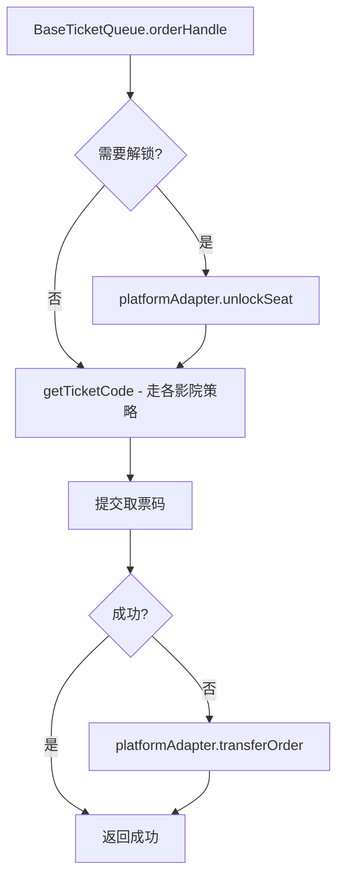

# 方案A：核心重构详细设计

> 对应 `src/common` 架构优化 — P0 级别全部事项
> 预估工时：5-8 个工作日（单人全职）

---

## 目录

- [1. 背景与目标](#1-背景与目标)
- [2. 变更一览](#2-变更一览)
- [3. 详细设计](#3-详细设计)
  - [3.1 重构 A：fetchOrders 公共逻辑提取到基类](#31-重构-afetchorders-公共逻辑提取到基类)
  - [3.2 重构 B：出票队列接入平台适配器](#32-重构-b出票队列接入平台适配器)
  - [3.3 重构 C：singleOffer 超时竞态修复](#33-重构-csingleoffer-超时竞态修复)
  - [3.4 重构 D：各平台单元测试补齐](#34-重构-d各平台单元测试补齐)
- [4. 影响范围与兼容性](#4-影响范围与兼容性)
- [5. 验收标准](#5-验收标准)
- [6. 后续可优化空间](#6-后续可优化空间)

---

## 1. 背景与目标

### 1.1 现状问题

`src/common/` 已建立清晰的架构骨架（配置中心 + 基类 + 工厂），但目前仅「猎人」平台完整走通新架构。其余 9 个平台（哈哈、芒果、蚂蚁、洋葱、影划算、守兔、麻花、省APP、商展）虽然已有适配器和队列的占位文件，但内部实现依然是旧模式的直接搬移，存在以下核心问题：

| 问题 | 位置 | 影响 |
|------|------|------|
| `fetchOrders()` 逻辑在 9 个队列中重复 | 各平台的 `*OfferQueue.js` | 约 700 行重复代码，每新增平台代价高 |
| 出票流程未接入适配器 | `BaseTicketQueue` + `autoTicket/buyTicket/` | 配置中心的 `unlockSeat`/`submitTicketCode`/`transferOrder` 等能力浪费 |
| `singleOffer` 超时竞态 | `BaseOfferQueue.orderHandle()` | 超时后实际流程仍在执行，可能产生脏数据 |
| 测试覆盖严重不足 | 仅覆盖基类和配置，无任一平台的真实队列/适配器测试 | 后续变更无安全网 |

### 1.2 本次目标

1. **消灭重复**：把 `fetchOrders()` 中的字段标准化、登录过滤、去重插入等公共逻辑提到 `BaseOfferQueue`
2. **打通链路**：让出票队列真正通过 `platformAdapter` 调用平台的 `unlockSeat()` / `submitTicketCode()` / `transferOrder()`
3. **修复隐患**：修复 `Promise.race` 超时竞态
4. **设安全网**：为所有 10 个平台的适配器和队列编写单元测试

---

## 2. 变更一览

| 重构编号 | 变更文件 | 操作 | 预估工时 |
|---------|---------|------|---------|
| A | `BaseOfferQueue.js` | 新增 `normalizeOrder()`、`filterByLoginInfo()` 等方法 | 0.5 天 |
| A | 9 个平台的 `*OfferQueue.js` | 大幅度精简，约 90→20 行 | 1.5 天 |
| A | `platform-config.js` | 可选：扩展 `transformOrder` 配置能力 | 0.5 天 |
| B | `BaseTicketQueue.js` | 重构 `orderHandle()`，接入适配器 | 1 天 |
| B | `BasePlatformAdapter.js` | 可能需微调接口 | 0.5 天 |
| B | 各平台适配器 | 补齐 `doConfirmOrder()` 等未实现的方法 | 1 天 |
| C | `BaseOfferQueue.orderHandle()` | 修复超时竞态 | 0.5 天 |
| D | `tests/core/`、`tests/platform/` 等 | 为 10 个平台各写一套测试 | 3 天 |
| | 回归验证 + 文档更新 | | 1 天 |
| | **合计** | | **5-8 天** |

---

## 3. 详细设计

### 3.1 重构 A：fetchOrders 公共逻辑提取到基类

#### 3.1.1 现状分析

当前 10 个平台的 `fetchOrders()` 方法结构完全相同：

```
[ mockDelay ] → [ getStayOfferList ] → [ 字段标准化 .map ] → [ 登录过滤 .filter ]
→ [ 影院标识二次 .map ] → [ 去重 .filter ] → [ 逐一 handleNewOrder ]
```

每个队列 80-90 行中，**仅有约 15 行是平台特有的**（字段映射逻辑），其余 70+ 行完全相同。

#### 3.1.2 设计变更

**步骤 1：在 `BaseOfferQueue` 中新增模板方法**

```javascript
// BaseOfferQueue 新增方法

/**
 * 标准化单个原始订单为统一格式
 * 子类必须实现：返回标准订单对象
 * @param {Object} rawOrder - 平台原始订单
 * @returns {Object|null} 标准订单，返回 null 表示过滤该订单
 */
normalizeOrder(rawOrder) {
  throw new Error(`平台 ${this.platName} 未实现 normalizeOrder 方法`);
}

/**
 * 判断订单是否有可用的登录信息
 * 子类可覆盖，默认使用 getCinemaFlag + getCinemaLoginInfoList
 * @param {Object} order - 标准订单
 * @returns {boolean}
 */
hasValidLoginInfo(order) {
  try {
    const { getCinemaFlag, getCinemaLoginInfoList } = require('@/utils/utils');
    const appFlag = getCinemaFlag(order);
    if (!appFlag) return false;
    const appLoginInfo = getCinemaLoginInfoList().find(
      item => item.app_name === appFlag && item.mobile && item.session_id
    );
    return !!appLoginInfo;
  } catch {
    return true; // 默认通过
  }
}

/**
 * 获取旧订单（用于日志对比）
 * 子类可覆盖
 * @param {Object} rawOrder - 原始订单
 * @param {Array} rawList - 原始订单列表
 * @returns {Object|null}
 */
findOldOrder(rawOrder, rawList) {
  return null;
}
```

**步骤 2：新增 fetchOrders 基类实现**

```javascript
// BaseOfferQueue 重写 fetchOrders（标记为 final，子类不再重写）

async fetchOrders(fetchDelay) {
  const { mockDelay } = await import('@/utils/utils');
  await mockDelay(fetchDelay);

  const rawList = await this.getStayOfferList();
  if (!rawList?.length) return;

  // 1. 标准化 - 子类负责字段映射
  const processedList = [];
  for (const raw of rawList) {
    const normalized = this.normalizeOrder(raw);
    if (!normalized) continue; // 子类返回 null 表示过滤
    processedList.push(normalized);
  }
  if (!processedList.length) return;

  // 2. 登录信息过滤
  const withLoginInfo = processedList.filter(o => this.hasValidLoginInfo(o));
  if (!withLoginInfo.length) return;

  // 3. 补全影院标识信息
  const completed = withLoginInfo.map(item => {
    const { GET_APP_INFO } = require('@/common/constant');
    const app_type_code = GET_APP_INFO(item.app_name)?.app_type_code;
    return { ...item, app_type_code };
  });

  // 4. 去重
  const newOrders = completed.filter(
    item => !this.handledOrders.has(item.order_number)
  );
  if (!newOrders.length) return;

  // 5. 入队
  newOrders.forEach(item => {
    const oldOrder = this.findOldOrder(item, rawList);
    this.handleNewOrder(item, oldOrder);
  });
}

/**
 * 子类只需提供原始订单列表
 * 不再需要重写 fetchOrders
 */
async getStayOfferList() {
  throw new Error(`平台 ${this.platName} 未实现 getStayOfferList 方法`);
}
```

**步骤 3：各子类改造示例**

对比改造前后的代码量：

| 队列 | 当前行数 | 改造后行数 |
|------|---------|-----------|
| `LierenOfferQueue` | ~85 | ~20 |
| `HahaOfferQueue` | ~90 | ~25 |
| `MangguoOfferQueue` | ~95 | ~25 |
| `MayiOfferQueue` | ~90 | ~20 |
| `YangcongOfferQueue` | ~100 | ~30 |
| `YinghuasuanOfferQueue` | ~90 | ~20 |
| `ShoutuOfferQueue` | ~90 | ~20 |
| `MahuaOfferQueue` | ~90 | ~20 |
| `ShengOfferQueue` | ~90 | ~20 |
| `ShangzhanOfferQueue` | ~90 | ~20 |

改造后 `LierenOfferQueue` 示例：

```javascript
export default class LierenOfferQueue extends BaseOfferQueue {
  constructor(isTestOrder = false) {
    const logger = new Logger({ logType: 1 });
    const adapter = new LierenAdapter(logger, isTestOrder);
    super(adapter, 'lieren', isTestOrder);
  }

  /** 只需实现：标准化订单字段 */
  normalizeOrder(raw) {
    const app_name = getCinemaFlag(raw);
    if (!app_name) return null;
    return {
      ...raw,
      plat_name: 'lieren',
      app_name,
      appName: app_name,
      app_type_code: GET_APP_INFO(app_name)?.app_type_code,
      rewards: LIERENR_REWARDS[raw.order_urgent] || 0,
      offer_end_time: raw.sytime * 1000,
    };
  }

  async getStayOfferList() {
    try {
      const res = await this.platformAdapter.fetchOrderList({});
      return res || [];
    } catch (error) { return []; }
  }

  /** 仅猎人有规则ID逻辑，保持子类实现 */
  async getRuleId(order, logger, offerRule) {
    if (offerRule.offerType === '1') return null;
    return await getRuleIdByPlat({ ... });
  }
}
```

**步骤 4：配置中心配合增强（可选）**

在 `platform-config.js` 中，可以为每个平台配置一个 `fieldMapping` 字段，让字段标准化也配置化：

```javascript
// platform-config.js 增强（可选，替代子类 normalizeOrder）
fieldMapping: {
  id: 'id',
  tpp_price: 'maoyan_price',
  supplier_max_price: 'maxPrice',
  city_name: 'cityName',
  cinema_addr: 'address',
  ticket_num: 'seat_num',
  cinema_name: 'cinemaName',
  hall_name: 'hallName',
  film_name: 'movieName',
  show_time: 'time',
  order_number: 'order_id',
  offer_end_time: raw => +new Date(raw.orderExpireTime),
}
```

但考虑到各平台的字段映射差异较大且包含计算逻辑（如 `offer_end_time` 有的来自 `sytime * 1000`、有的来自倒计时计算），**不建议强行配置化**，子类 `normalizeOrder()` 的灵活性更合适。

---

### 3.2 重构 B：出票队列接入平台适配器

#### 3.2.1 现状分析

当前出票流程：

```
BaseTicketQueue.orderHandle()
  → StrategyFactory.createSeatStrategy(order, logger, isTestOrder)
    → 各影院 buyTicket.js（ume/sfc/chenxing/fenghuang/jinyi/lma/h5ume）
      → 自己独立实现锁座、下单、提交取票码
        → 完全没有用到 platformAdapter
```

问题：
- 配置中心中已定义的 `unlockSeat()`、`submitTicketCode()`、`transferOrder()` 能力被浪费
- 各影院系统自己实现提交取票码到平台，代码重复
- 平台特有的错误处理（如猎人已自动报价的判断）在出票侧无法复用

#### 3.2.2 设计变更

**整体思路：** 在 `BaseTicketQueue` 中新增 `platformAdapter` 引用，将「提交取票码」和「转单」步骤委托给适配器。



**步骤 1：修改 `BaseTicketQueue` 构造函数**

```javascript
export default class BaseTicketQueue {
  constructor(appFlag, isTestOrder = false, platformAdapter = null) {
    this.appFlag = appFlag;
    this.isTestOrder = isTestOrder;
    this.platformAdapter = platformAdapter; // 新增：可选
    // ... 原有代码
  }
}
```

**步骤 2：重构 `orderHandle()` 方法**

```javascript
async orderHandle(order, logger) {
  try {
    logger.infoSave(`订单开始出票，订单号-${order.order_number}`);
    if (!this.isRunning) return;

    // 1. 获取出票策略（各影院系统自己的锁座、下单逻辑）
    const buyTicket = StrategyFactory.createSeatStrategy(
      order, logger, this.isTestOrder
    );

    // 2. 执行出票，获取取票码
    const res = await buyTicket.singleTicket();
    // res 结构: { profit, submitRes, qrcode, quan_code, card_id, cardNum, ... }

    // 3. 如果出票成功（拿到了取票码），且平台适配器存在，走适配器提交取票码
    if (res?.qrcode && this.platformAdapter) {
      const submitRes = await this.platformAdapter.submitTicketCode(
        order, res.qrcode, { logger }
      );
      res.submitRes = submitRes; // 用适配器的返回覆盖
    }

    // 4. 如果出票失败，走适配器转单
    if (!res?.submitRes && this.platformAdapter) {
      const transferRes = await this.platformAdapter.transferOrder(
        order, '无法出票', { logger }
      );
      res.transferRes = transferRes;
    }

    return res;
  } catch (error) {
    logger.errorSave('订单执行出票异常', { error });
  }
}
```

**关键设计决策：** 此次重构**不改变**各影院系统的 `buyTicket.js` 内部逻辑（那属于 P2 范围）。只改变「获取到取票码后怎么提交」和「失败后怎么转单」这两步——把它们从各影院各自的实现中，统一收归到 `BaseTicketQueue` 通过适配器处理。

这意味着各影院的 `buyTicket.singleTicket()` 内部依然维持原有逻辑（包含它们自己实现的下单提码），但新增的 `BaseTicketQueue` 外层会再调用一次适配器的 `submitTicketCode()`。

> ⚠️ **需要注意**：部分平台（如芒果的 `orderHandle` 已经在各影院内部处理了提交取票码），需要在重构时区分：
> - 如果 `buyTicket.singleTicket()` 返回中 `submitRes` 已经有值，则跳过适配器的 `submitTicketCode`
> - 如果 `buyTicket.singleTicket()` 只返回 `qrcode`（取票码），则由适配器代劳提交

**步骤 3：`createTicketQueueFun` 工厂传入适配器**

修改 `comTicketHandle.js`：

```javascript
import platformFactory from '@/common/factories/PlatformFactory';
import BaseTicketQueue from '@/common/core/BaseTicketQueue';

const createTicketQueueFun = (appFlag, platName = null) => {
  const adapter = platName ? platformFactory.get(platName) : null;
  return new BaseTicketQueue(appFlag, false, adapter);
};
```

这样在 `queueManage/index.vue` 中可以按平台传入适配器：

```javascript
// 出票队列传入对应的平台适配器
const ticketQueue = createTicketQueueFun('hsmzyc', 'lieren');
```

---

### 3.3 重构 C：singleOffer 超时竞态修复

#### 3.3.1 现状

```javascript
offerResult = await Promise.race([
  this.singleOffer({ order, offerList: [], logger }),
  new Promise((resolve, reject) =>
    setTimeout(() => {
      logger.infoSave(`超时`);
      resolve();  // ← 超时后 resolve(undefined)
      // 但 this.singleOffer 仍在执行！
    }, offerHandleTimeout)
  )
]);
```

问题：超时后 `offerResult` 变为 `undefined`，后续逻辑正常走完（如 `addOrderHandleRecord` 会记录空数据）。但实际的报价请求仍在后台进行可能导致：
- 重复报价
- 报价记录写入不全
- 队列状态紊乱（`runningCountBySeries` 在 finally 中恢复，但超时的 Promise 可能已不指向正确上下文）

#### 3.3.2 设计变更

使用 **AbortController** 模式，或更轻量的 **flag + 忽略超时后结果** 方案：

```javascript
// 方案选择：轻量 flag 方案（避免引入 AbortController 兼容问题）
let isTimedOut = false;
const timeoutPromise = new Promise(resolve =>
  setTimeout(() => {
    isTimedOut = true;
    logger.infoSave(`订单报价处理超时，超过${offerHandleTimeout}ms 未完成`);
    resolve();
  }, offerHandleTimeout)
);

offerResult = await Promise.race([
  this.singleOffer({ order, offerList: [], logger }),
  timeoutPromise
]);

if (isTimedOut) {
  // 超时后，放弃本次报价结果
  // 队列通过 startProcessingQueue 的 finally 自动恢复
  logger.infoSave('订单已超时，放弃本次报价结果');
  return; // 直接返回，不走 addOrderHandleRecord
}
```

**额外优化：** 对于已超时的 Promise，理论上无法取消。但可以在 `singleOffer` 内部做一次「是否已超时」检查，避免在超时后继续执行重量级操作：

```javascript
// singleOffer 内部
const result = await offerExample.getEndOfferPrice({ order, offerList });
if (this._currentOrderTimedOut) { // 在 orderHandle 中设置一个实例级 flag
  logger.infoSave('订单已超时，放弃处理报价结果');
  return;
}
```

---

### 3.4 重构 D：各平台单元测试补齐

#### 3.4.1 测试文件清单

| 测试文件 | 测试内容 | 预估用例数 |
|---------|---------|-----------|
| `tests/platform/LierenAdapter.test.js` | 4 个方法（fetchOrderList / submitOffer / confirmOrder / fetchTicketOrderList） | ~12 |
| `tests/platform/HahaAdapter.test.js` | 同上 | ~10 |
| `tests/platform/MangguoAdapter.test.js` | 同上 | ~10 |
| `tests/platform/MayiAdapter.test.js` | 同上 | ~10 |
| `tests/platform/YangcongAdapter.test.js` | 同上 | ~10 |
| `tests/platform/YinghuasuanAdapter.test.js` | 同上 | ~10 |
| `tests/platform/ShoutuAdapter.test.js` | 同上 | ~10 |
| `tests/platform/MahuaAdapter.test.js` | 同上 | ~10 |
| `tests/platform/ShengAdapter.test.js` | 同上 | ~10 |
| `tests/platform/ShangzhanAdapter.test.js` | 同上 | ~10 |
| `tests/queues/LierenOfferQueue.test.js` | normalizeOrder / getStayOfferList / getRuleId | ~8 |
| `tests/queues/HahaOfferQueue.test.js` | normalizeOrder / getStayOfferList | ~6 |
| `tests/queues/MangguoOfferQueue.test.js` | 同上 | ~6 |
| ... 其余 8 个队列 | | ~48 (6×8) |
| `tests/core/BaseOfferQueue.test.js` | 增强：fetchOrders 模板方法 / normalizeOrder / hasValidLoginInfo | ~10 |
| `tests/core/BaseTicketQueue.test.js` | 增强：适配器接入后的 orderHandle | ~8 |
| **合计** | | **~188** |

#### 3.4.2 测试模式

每个适配器的测试覆盖 4 个维度：

| 维度 | 测试内容 |
|------|---------|
| 正常调用 | API 正常返回，验证参数正确传递、返回值正确解析 |
| 异常调用 | API 抛出错误，验证捕获和日志 |
| 空数据 | API 返回空列表，验证返回空数组 |
| 测试模式 | `isTestOrder=true` 时，不真正调用 API |

每个队列的测试覆盖 3 个维度：

| 维度 | 测试内容 |
|------|---------|
| 字段标准化 | 输入原始订单，输出标准化订单字段正确 |
| 登录过滤 | 无登录信息时正确过滤 |
| 去重 | 已处理订单不再重复入队 |

#### 3.4.3 Mock 策略

```javascript
// 统一的 Mock 工厂
export function createMockAdapter(platName, mockMethods = {}) {
  const mockApi = {
    queryStayOfferList: jest.fn().mockResolvedValue({ data: [] }),
    submitOffer: jest.fn().mockResolvedValue({ code: 1 }),
    stayTicketingList: jest.fn().mockResolvedValue({ data: [] }),
    confirmOrder: jest.fn().mockResolvedValue({ code: 1 }),
    unlockSeat: jest.fn().mockResolvedValue({ msg: 'success' }),
    submitTicketCode: jest.fn().mockResolvedValue({ code: 1 }),
    transferOrder: jest.fn().mockResolvedValue({ code: 1 }),
    ...mockMethods
  };

  const mockLogger = {
    infoSave: jest.fn(),
    errorSave: jest.fn(),
    warnSave: jest.fn(),
    warn: jest.fn(),
    info: jest.fn(),
    error: jest.fn(),
    logUpload: jest.fn().mockResolvedValue(),
    getLastErrMsgAndInfo: jest.fn().mockReturnValue({ err_msg: '', err_info: '' }),
    init: jest.fn()
  };

  const AdapterClass = platformFactory.getAdapterClass(platName);
  const adapter = new AdapterClass(mockLogger);
  adapter.api = mockApi;
  return { adapter, mockApi, mockLogger };
}
```

---

## 4. 影响范围与兼容性

### 4.1 向后兼容策略

| 变更 | 兼容性 | 备注 |
|------|--------|------|
| `fetchOrders` 提到基类 | **不兼容子类** | 9 个队列的 `fetchOrders` 方法名保留但不再被调用，基类用新的模板方法替代。需要一次性修改所有子类 |
| `normalizeOrder()` 新增 | 新增接口 | 子类必须实现，否则抛错 |
| `BaseTicketQueue` 构造函数增加参数 | **兼容**（可选参数） | 不传 adapter 则走原有逻辑 |
| `comTicketHandle.js` 改造 | **兼容** | 保持旧签名 `(appFlag)` 不加 adapter 时行为不变 |
| 测试文件新增 | 纯新增 | 无影响 |

### 4.2 需要同步修改的外部文件

| 文件 | 修改内容 |
|------|---------|
| `src/views/queueManage/index.vue` | 如果传入了 `platName` 给 `createTicketQueueFun`，需做适配 |
| `src/common/platform/adapters/MahuaAdapter.js` | 麻花的 `submitOffer` 参数特殊（需要 `offerRule`），需确保适配器方法签名与基类一致 |

### 4.3 风险点

1. **麻花平台 (`mahua`) 的 `submitOffer` 签名特殊**：它的 `offerParams` 返回 `{ order_id, price, offerRule, order }`，且适配器或队列需要根据 `offerRule` 计算 `isDirectGetOrder`。需要确认该特殊逻辑在重构后是否正常工作。

2. **影划算 (`yinghuasuan`) 报价后有特殊逻辑**：`if (order.plat_name === 'yinghuasuan' && res?.data?.quote_id) { order.id = res?.data?.quote_id }`。这是 `singleOffer` 中的硬编码，建议改为配置驱动或适配器方法。

3. **出票侧的 `buyTicket.singleTicket()` 内部实现不一致**：有的影院系统（如 ume）的 `singleTicket()` 已经包含了提交取票码并返回 `submitRes`，有的可能不包含。需要逐一确认，在 `BaseTicketQueue.orderHandle()` 中区分处理。

---

## 5. 验收标准

### 5.1 功能验收

| 验收项 | 验证方式 |
|--------|---------|
| 10 个平台的报价队列启动后能正常拉取订单 | 运行测试 `queue.test.js` |
| 标准化后的订单字段与重构前一致 | 对比新旧代码输出的 JSON |
| 出票队列调用适配器的 `unlockSeat` / `submitTicketCode` | 单元测试验证 mock 调用 |
| `singleOffer` 超时后不执行后续记录 | 超时场景单元测试 |
| 所有 10 个平台的适配器测试通过 | `yarn test` |
| 所有 10 个队列的测试通过 | `yarn test` |

### 5.2 代码质量验收

| 验收项 | 标准 |
|--------|------|
| 重复代码消除量 | 至少减少 600 行 |
| 每个队列文件行数 | 不超过 25 行（不含注释） |
| 测试覆盖率（新增） | 10 个适配器 + 10 个队列 |
| 测试用例总数 | ≥ 150 个 |

---

## 6. 后续可优化空间

以下为本次方案 A **不做、但保留优化空间**的事项，供后续参考：

### P1 级（中等优先级，建议 1-2 周内完成）

| 事项 | 说明 | 预估 |
|------|------|------|
| **全局窗口挂载消除** | `src/common/index.js` 将 `APP_API_OBJ` / `PLAT_API_OBJ` 挂到 `window` 上。建议改为 Pinia store 或依赖注入 | 1-2 天 |
| **`cancelablePromise` 工具函数** | 将 `AbortController` 封装为可复用的 Promise 取消工具，应用于 `singleOffer` 等所有含超时逻辑的地方 | 0.5 天 |
| **队列健康检查与自动恢复** | 为 `BaseOfferQueue.start()` 添加指数退避重试，避免单个异常导致队列静默停摆 | 0.5 天 |

### P2 级（较低优先级，推荐 P0 稳定后再做）

| 事项 | 说明 | 预估 |
|------|------|------|
| **`autoTicket/buyTicket` 各影院系统提取基类** | 7 套影院系统的 `buyTicket.js` / `cardQuanManage.js` / `orderManage.js` 等存在大量重复逻辑（锁座、卡券下单、选座）。可提取 `BaseCinemaBuyTicket` / `BaseCardQuanManager` / `BaseSeatManager` 基类，将 29,534 行降至约 15,000 行 | 10-15 天 |
| **平台配置全面配置化** | 将 `normalizeOrder` 中的字段映射完全移到 `platform-config.js` 配置中，实现「零代码新增平台」 | 2-3 天 |
| **报价记录入库统一化** | `addOrderHandleRecord` 在不同平台间有微小差异（如影划算需要更新 `order.id`），可进一步提取 | 1 天 |

### P3 级（长期优化，不影响功能）

| 事项 | 说明 | 预估 |
|------|------|------|
| **`src/common/` TypeScript 迁移** | ~38,000 行 JS 转 TS，定义完整的 `PlatformConfig` / `Order` / `OfferResult` 等类型 | 5-7 天 |
| **E2E 测试** | 使用 Playwright 或 Cypress 增加端到端测试，验证真实 API 链路的完整流程 | 5-7 天 |
| **性能基准与监控** | 增加队列吞吐量、请求耗时等关键指标的上报，辅助定位性能瓶颈 | 2-3 天 |

---

## 附录 A：文件变更清单

```
Modified:
  src/common/core/BaseOfferQueue.js         ← 新增 normalizeOrder / fetchOrders 模板方法
  src/common/core/BaseTicketQueue.js        ← 新增 platformAdapter 支持
  src/common/core/BasePlatformAdapter.js    ← 可能微调接口
  src/common/autoTicket/comTicketHandle.js  ← 传入 adapter
  src/common/platform/configs/platform-config.js ← 可选增强
  src/common/platform/queues/LierenOfferQueue.js   ← 精简
  src/common/platform/queues/HahaOfferQueue.js     ← 精简
  src/common/platform/queues/MangguoOfferQueue.js  ← 精简
  src/common/platform/queues/MayiOfferQueue.js     ← 精简
  src/common/platform/queues/YangcongOfferQueue.js ← 精简
  src/common/platform/queues/YinghuasuanOfferQueue.js ← 精简
  src/common/platform/queues/ShoutuOfferQueue.js   ← 精简
  src/common/platform/queues/MahuaOfferQueue.js    ← 精简
  src/common/platform/queues/ShengOfferQueue.js    ← 精简
  src/common/platform/queues/ShangzhanOfferQueue.js ← 精简
  src/common/platform/adapters/HahaAdapter.js     ← 补齐 doConfirmOrder
  src/common/platform/adapters/MangguoAdapter.js  ← 补齐 doConfirmOrder
  ... 以及其他需要的适配器补齐

New:
  src/common/tests/core/BaseOfferQueue.test.js    ← 增强
  src/common/tests/core/BaseTicketQueue.test.js   ← 增强
  src/common/tests/platform/LierenAdapter.test.js
  src/common/tests/platform/HahaAdapter.test.js
  src/common/tests/platform/MangguoAdapter.test.js
  src/common/tests/platform/MayiAdapter.test.js
  src/common/tests/platform/YangcongAdapter.test.js
  src/common/tests/platform/YinghuasuanAdapter.test.js
  src/common/tests/platform/ShoutuAdapter.test.js
  src/common/tests/platform/MahuaAdapter.test.js
  src/common/tests/platform/ShengAdapter.test.js
  src/common/tests/platform/ShangzhanAdapter.test.js
  src/common/tests/queues/LierenOfferQueue.test.js
  src/common/tests/queues/HahaOfferQueue.test.js
  src/common/tests/queues/MangguoOfferQueue.test.js
  ... (其余 8 个队列的测试文件)

Unchanged:
  src/common/autoTicket/buyTicket/           ← P2 范围，本次不动
  src/common/factories/                     ← 本次不动
  src/common/constant.js                    ← 本次不动
  src/common/logger.js                      ← 本次不动
  src/common/index.js                       ← 本次不动
```
