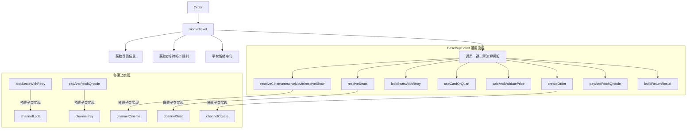

## 自动出票买票模块优化方案（仅 buyTicket 目录）

### 目标

- **单点维护**：各影院系列（辰星系列、凤凰系列、LMA系列、SFC系列、UME系列、UME H5系列等）在修改通用逻辑时，只改一处或少数几处即可生效。
- **不动旧队列实现**：`commonAutoTicket.js` 和旧架构不再维护，本次仅围绕 `src/common/autoTicket/buyTicket` 下的策略类及其依赖作方案设计。
- **保持行为一致**：在不改变现有业务行为的前提下，先做“内部收敛”，后续再做增量改动时成本更低。

### 重要概念说明

- **影院系列（app_type_code）**：如 `chenxing_applet`、`sfc_applet`、`ume_applet`、`lma` 等，代表一类影院的出票逻辑
- **具体影院（appFlag/app_name）**：每个系列下的不同影院，如辰星系列下的 `guangmeiwenhua`、`yaolai` 等
- **层级关系**：`StrategyFactory` 按 `app_type_code` 选择系列类（如 `ChenxingBuyTicket`、`SfcBuyTicket`），每个系列类内部处理该系列下所有 `appFlag` 的逻辑

### 现状简要梳理

- **统一入口**：`buyTicket/index.js` 通过 `STRATEGY_MAP` + `StrategyFactory.createSeatStrategy(order, logger, isTestOrder)` 根据订单的 `app_type_code` 选择对应系列策略类，如 `ChenxingBuyTicket`（辰星系列）、`SfcBuyTicket`（SFC系列）、`UmeBuyTicket`（UME系列）、`LmaBuyTicket`（LMA系列）等。每个系列类内部处理该系列下所有 `appFlag`（具体影院）的出票逻辑。
- **基类抽象**：
  - `BaseBuyTicket` 已经统一了：
    - `singleTicket()` 外部模板方法：日志 → 获取登录信息 → 获取报价规则 → 校验报价规则 → 平台解锁座位 → 调用子类 `oneClickBuyTicket()` → 返回标准结果。
    - `getOrderOfferRule()`、`checkOfferRuleRes()` 已封装为通用逻辑。
  - 各平台在 `oneClickBuyTicket()` 内部仍然大量重复：
    - 登录账号排序（按 `first`、当前登录手机号、卡/券库存等）。
    - 影院/影片/场次匹配（基于 `getMovieInfoFromFilmName`、`findMostRepeatedChars`、`isNextDay` 等工具）。
    - 座位解析（lockseat → seat ids/seat_arr/ticketDetail）。
    - 锁座 + 重试逻辑。
    - 用卡/用券策略与价格验算（券手续费、会员价、利润校验）。
    - 失败降级：换号 / 转单。
    - 测试模式下打印参数 + 取消订单/释放座位的流程。
- **系列差异**：
  - 不同系列（UME/LMA/SFC/辰星等）在数据结构上不同，但出票步骤基本相同，仅是“取数据”和“调用 API”方式不一样。
  - 同一系列下的不同影院（appFlag）通常共享相同的出票逻辑，差异主要体现在配置和参数上。
  - 各系列还各自实现了 `validateTicketOrder()`，结构极其相似，只是调用的 `cinemaManage/seatManage/cardQuanManage` 有差异。

### 总体设计思路

- **思路核心**：把“流程骨架”和“跨系列完全通用的校验/降级逻辑”尽量上移到 `BaseBuyTicket` 或一个新的 `buyTicket/common/*` 工具层；各系列类只实现少量“强依赖系列协议”的小方法（如“怎么查城市列表”、“怎么锁座”、“怎么创建订单”）。同一系列下的不同影院（appFlag）共享该系列类的实现。
- **目标结构**：



- **收敛策略**：
  - 先不强制把所有渠道都改到“完全一样”的流程，只要求：
    - 共性步骤（校验规则、测试模式行为、卡券价格校验、转单/换号判断、错误通知）统一到一处。
    - 差异较小的逻辑（比如 UME系列/LMA系列/SFC系列的“城市/影院/座位匹配”）通过“公共助手 + 少量参数”抽象起来。

### 具体优化点与落地方案

#### 1. 标准化 `oneClickBuyTicket` 模板，拆成可复用钩子

- **问题**：目前每个渠道的 `oneClickBuyTicket` 又长又大，一改流程就要 N 处同步；测试模式打印/取消逻辑也散落在每个实现中。
- **方案**：
  - 在 `BaseBuyTicket` 新增一套“通用模板方法 + 钩子”体系：
    - `async coreOneClickBuyTicket(context)`：
      - 默认实现完整流程：

        1. `await this.prepareFirstLoginAndSort(context)`：首次账号选择 & 登录排序。
        2. `const cinemaCtx = await this.resolveCinemaAndMovie(context)`：城市/影院/影片/场次解析。
        3. `const seatCtx = await this.resolveSeats(cinemaCtx)`：目标座位解析。
        4. `const lockCtx = await this.lockSeatsWithRetry(seatCtx)`：锁座 + 平台特定重试。
        5. `const benefitCtx = await this.useCardOrQuan(lockCtx)`：卡券决策。
        6. `const priceCtx = await this.calcAndValidatePrice(benefitCtx)`：渠道价格接口 + 通用利润/手续费校验（券手续费、会员价差、无利润则转单）。
        7. `const orderCtx = await this.createOrder(priceCtx)`。
        8. `if (this.isTestOrder) return await this.handleTestMode(orderCtx);`。
        9. `const payCtx = await this.payAndFetchQrcode(orderCtx)`。
        10. `return this.buildTicketResult(payCtx)`。

    - 提供一系列可被子类覆盖/复用的默认实现：
      - `prepareFirstLoginAndSort(context)`：内部调用 `getCinemaLoginInfo()` + 一些公用排序逻辑（见下一条）。
      - `calcAndValidatePrice(ctx)`：抽取各渠道当前相似的“券手续费×票数/会员价×票数/利润调整”校验为一份通用实现，只把“渠道返回字段名、是否有活动价”等交给子类提供。
      - `handleTestMode(ctx)`：统一测试模式行为：
        - 打印 `buyParams`；
        - 调用子类的 `cancelOrReleaseOrderForTest(ctx)` 来做“取消订单/释放座位”；
        - 统一返回 `{ offerRule: this.offerRule }` 或含 offerRule 的对象。
  - 各系列类的 `oneClickBuyTicket` 改为调用基类的：
    - 简单系列（辰星系列/LMA系列/UME系列/SFC系列）可直接：

      ```js
      async oneClickBuyTicket(item) {
        return this.coreOneClickBuyTicket({ rawOrder: item });
      }
      ```

    - 差异较大的系列可重写个别钩子，例如 UME系列的“活动价 + 最优卡券组合”保留在自己的 `useCardOrQuan` 和 `calcAndValidatePrice` 覆盖实现中。

#### 2. 登录账号获取与排序统一封装

- **问题**：UME系列、LMA系列、SFC系列都实现了：
  - 从 `getCinemaLoginInfoList()` 过滤 `app_name/mobile/session_id/member_pwd`。
  - 再按 `first === "1"`、当前登录用户手机号、卡/券对应手机号排序。
- **方案**：
  - 在 `BaseBuyTicket` 或 `buyTicket/common/loginHelper.js` 新增：
    - `getBaseLoginList(appFlag)`：封装 `getCinemaLoginInfoList().filter(...)`。
    - `sortLoginByFirstAndCurrentUser(list, currentUserPhone)`：共用的第一层排序。
    - `sortLoginByCardPhones(list, cardLinkMobile)`：按“有可用卡手机号”优先。
    - `sortLoginByQuanPhones(list, quanMobileList)`：按“券库存&顺序”优先。
  - 各系列类的 `getCinemaLoginInfo` 改为组合调用这些 helper，而不是复制完整排序逻辑；LMA系列特有的 `lmaToken` 字段，只在本系列类追加一行 `map(item => ({ ...item, lmaToken: item.session_id }))` 即可。
  - 结果：
    - 卡/券引起的排序规则后续有变，只需改 loginHelper 一处。

#### 3. 城市/影院/影片/场次/座位匹配逻辑抽象成公共工具

- **问题**：UME系列、SFC系列、LMA系列的 `oneClickBuyTicket` 多次重复：
  - 城市/影院列表查询 → `getTargetCinemaCommon()` 匹配影院；
  - `getMovieInfoFromFilmName()` 匹配影片；
  - `isNextDay`/`getPreviousDay` 处理跨天场次；
  - `findMostRepeatedChars` 解决同一时刻多场次选厅逻辑；
  - lockseat 字符串解析为座位 id 数组或 seat_arr。
- **方案**：
  - 在 `buyTicket/common` 下新增若干纯函数模块：
    - `movieResolver.js`：
      - `resolveMovieAndShow({film_name, hall_name, show_time, appFlag, movieData, showDataAdapter})`：内置跨天处理和相似度选择，`showDataAdapter` 由系列类提供（将 UME系列/SFC系列/LMA系列各自 show 对象字段映射到统一字段）。
    - `cinemaResolver.js`：
      - `resolveCinema({appFlag, plat_cinema_code, city_name, cityCinemaList, cinemaListAdapter})`：封装 `getTargetCinemaCommon` 等调用。
    - `seatResolver.js`：
      - 提供 `parseLockseatToNames(lockseat)`、`matchSeatsByNames(seatList, names)`、以及各平台已有的“按行+列号匹配”的通用版本，渠道仅提供 seatList 的结构适配函数。
  - 各渠道在自己的 `oneClickBuyTicket` 钩子里调用这些公共 resolver，只传入适配器：
    - 后续统一规则（比如“多场次选择策略”）只在 common 里改一次即可影响所有平台。

#### 4. 卡券/价格/利润校验逻辑统一

- **问题**：各渠道都做了类似的：
  - 券手续费 `quan_fee` × 票数上限；
  - 会员价 `real_member_price` × 票数 与实际支付金额比较；
  - 利润 `profit` 调整或放弃（转单）；
  - 部分地方还对 `member_discount` 做加成。
- **方案**：
  - 在 `BaseBuyTicket` 新增公共方法：
    - `validateCouponPrice({offerRule, ticket_num, paymentAmount, useQuan})`：
      - 统一判断：用券 + 需补差价时 `paymentAmount <= quan_fee * ticket_num`；否则返回“需转单”的原因。
    - `validateCardPriceAndProfit({offerRule, ticket_num, paymentAmount, profit})`：
      - 执行“发现支付金额 > 会员价*票数 → 调整 profit 或转单”的逻辑；
      - 执行“支付金额 < 会员价*票数 → 按 member_discount 增加利润”的逻辑；
      - 返回调整后的 `profit` 及是否可继续出票。
  - 各渠道在各自的 `calcAndValidatePrice` 步骤中统一使用上述方法，只负责组织参数。
  - 效果：以后改利润算法或券手续费判断，只改 BaseBuyTicket 一处。

#### 5. 测试模式（isTestOrder）行为统一

- **问题**：辰星、SFC、UME、LMA 都有类似逻辑：
  - 组装 `buyParams` → `console.log + logger.infoSave`；
  - 根据有无 `order_num/orderHeaderId/order_str` 选择“取消订单”或“释放座位”；
  - 最终返回 `{ offerRule }` 或包含报价规则的结果。
- **方案**：
  - 在 `BaseBuyTicket` 中新增：
    - `buildTestBuyParams(channelContext)`：构造通用结构（订单核心字段 + 渠道扩展字段）。
    - `async handleTestMode(ctx)`：

      1. 调用 `buildTestBuyParams` → 打日志。
      2. 调用子类实现的 `cancelOrReleaseOrderForTest(ctx)`（仅封装渠道差异：UME 用 `orderHeaderId`，LMA 用 `order_str`，SFC 用 `order_num`）。
      3. 返回 `{ offerRule: this.offerRule }`。

  - 各系列类 `oneClickBuyTicket` 中的测试分支删除，统一走 `BaseBuyTicket.coreOneClickBuyTicket` 内部逻辑，减少未来新增字段时的同步成本。

#### 6. 换号/转单降级流程抽象

- **问题**：每个渠道都有类似“用卡/用券/建单失败则：

1）如果还有账号 → 换号再来一遍；

2）否则 → 转单”的模式，写法不同但语义一致。

- **方案**：
  - 在 `BaseBuyTicket` 内抽象：
    - `async fallbackWithChangePhoneOrTransfer({reason, unlockOrCancelParams, rebuildParams})`：
      - 检查 `currentParamsInx < currentParamsList.length - 1`：
        - 是：`currentParamsInx++`，调用 `this.oneClickBuyTicket(rebuildParams)`。
        - 否：`return { offerRule: this.offerRule, transferParams: await this.orderManage.transferOrder(unlockOrCancelParams) }`。
  - 各系列类仅在合适的时机提供 `unlockOrCancelParams` 与 `rebuildParams`，不再重复写 if/else 模板逻辑。

#### 7. `validateTicketOrder` 统一骨架

- **问题**：UME、LMA、SFC 的 `validateTicketOrder` 几乎是“完整流程但卡在锁座/支付前”，只是调用的 manage 类不同。
- **方案**：
  - 在 `BaseBuyTicket` 中提供一个“通用验证骨架”：
    - 步骤：订单字段校验 → 登录信息 → 报价规则 → 影院信息 → 影片/场次 → 座位 → 卡/券可用性。
    - 使用前面第 3/4/6 点中抽象出来的 resolver 和校验方法。
  - 各系列类的 `validateTicketOrder` 只需要：
    - 提供 `resolveCinemaForValidate`、`resolveShowForValidate`、`resolveSeatsForValidate` 等少数差异函数；
    - 或直接继承默认实现，只有特殊系列才覆写局部步骤。
  - 优点：以后验证增加新检查（比如新增一个“活动日规则”），只改 Base 一处。

### 后续迭代与落地顺序建议

1. **第 1 步：收集重复逻辑并抽象工具层**

   - 把各系列类 `oneClickBuyTicket` 中的共性片段整理到 `buyTicket/common/*` 与 `BaseBuyTicket` 新增方法中，不修改对外行为，只在内部复用。

2. **第 2 步：逐系列接入新模板**

   - 先选 1~2 个结构最规范的系列（如 SFC系列 + UME系列）切到 `coreOneClickBuyTicket` 模板，验证：
     - 功能无回归；
     - debug 日志是否更清晰。
   - 再平移 LMA系列、辰星系列，并统一 `validateTicketOrder` 的实现。

3. **第 3 步：梳理“扩展点”文档**

   - 在 `buyTicket` 目录补充一份开发文档：
     - 新增平台时必须实现的钩子列表（如 `resolveCinemaAndMovie` / `resolveSeats` / `lockSeatsWithRetry` / `createOrder` / `payAndFetchQrcode`）。
     - 哪些逻辑（报价规则校验、测试模式、卡券价格校验）禁止在子类手写，必须走基类统一实现。

4. **第 4 步：为新平台预留扩展机制**

   - 新系列只需要：
     - 创建对应的 `*CinemaManage/*SeatManage/*OrderManage/*CardQuanManage`。
     - 实现少量系列特有钩子。
     - 在 `buyTicket/index.js` 的 `STRATEGY_MAP` 中注册（按 `app_type_code` 映射）。
   - 多数通用行为（如测试模式、卡券价格校验、转单降级策略）全部“自动继承”。
   - 同一系列下的新影院（新 appFlag）通常无需额外代码，只需配置即可使用该系列类的逻辑。

### 已实现部分

- ✅ **BaseBuyTicket 通用方法**：
  - `coreOneClickBuyTicket(context)` - 通用模板骨架（可选使用）
  - `validateCouponPrice()` - 用券价格校验
  - `validateCardPriceAndProfit()` - 用卡价格与利润校验
  - `fallbackWithChangePhoneOrTransfer()` - 换号/转单降级处理
  - `handleTestMode()` - 测试模式统一处理
  - `buildTestBuyParams()` - 测试参数构造
  - `subDecimalSafe()` - 安全减法（避免浮点精度问题）

### 待实现部分

- ⏳ `buyTicket/common/loginHelper.js` - 登录排序工具
- ⏳ `buyTicket/common/movieResolver.js` - 影片/场次解析工具
- ⏳ `buyTicket/common/cinemaResolver.js` - 影院解析工具
- ⏳ `buyTicket/common/seatResolver.js` - 座位解析工具
- ⏳ 各系列类逐步迁移到使用基类通用方法
